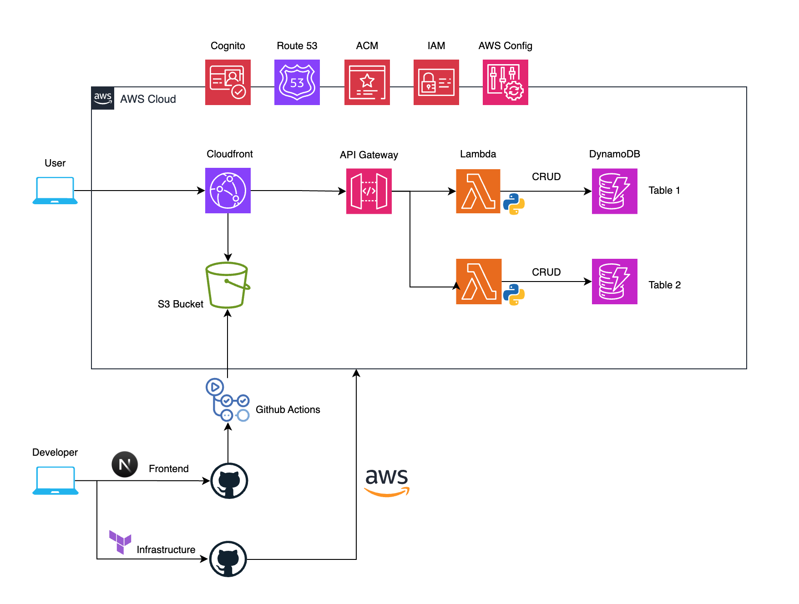

## Serverless Backend on AWS Project

## 1. Project Overview

A serverless backend built on AWS using a serverless backend to handle form submissions and store project data for a personal portfolio site.

## 2. Architecture Diagram

## 3. Infrastructure Details

- Cloud Provider: AWS
- Infrastructure as Code (IaC): Terraform  
   
  Key Resources:
- Networking: Cloudfront, Route 53
- Application Integration: API Gateway
- Compute: Lambda
- Storage: S3
- Database: DynamoDB
- Security: IAM Roles, Cognito, Amazon Certificate Manager
- Management and Governance: AWS Config, Cloudwatch
- CI/CD: GitHub Actions

## 4. Features

- Cloudfront for CDN caching and managing traffic to S3 and API gateway.
- Serverless API Gateway integrated with python runtime lambda functions for CRUD operations.
- S3 bucket for static hosting of application
- User Authentication via AWS Cognito
- Centralized logging and monitoring via CloudWatch
- Secure access with IAM
- Route 53 for DNS Records and Subdomain
- Infrastructure as Code with Terraform
- AWS Config to check Cloudfront sni compliance.
- CI/CD pipeline with GitHub Actions for automated deployment.
- SSL/TLS certificates via AWS Certificate Manager for secure HTTPS access.
- NoSQL DynamoDB Database for application data.
- S3 to store terraform backend and dynamoDB to lock state to prevent state drift

## 5. Deployment Process

Describe how it’s deployed:

- Steps to run Terraform or other IaC tools
- How environment variables are managed (e.g., AWS Secrets Manager)
- Deployment automation (e.g., GitHub Actions workflow file)

## 6. Cost Optimization & Scalability

- Serverless services used with pay as you go tier.
- Budget and Billing notifications set for notify abnormal cost escalation.
- AWS Config used to check Cloudfront comply to "sni".

## 7. Security & Compliance

- IAM least-privilege policies
- S3 bucket is private integrated with Cloudfront Origin Access Control
- Environment isolation (dev/staging/prod)

## 8. Challenges & Solutions

Briefly describe key technical challenges and how you solved them.
Example: “Faced cross-origin issues between S3 and API Gateway — resolved by configuring CORS headers in Lambda responses.”

- Creating custom terraform modules using only variables was a challenge at first. I overcome this by stuying the documentation and figuring out how terraform hadle functions and variables.

## 9. Future Improvements

Show awareness of scalability and maintenance:

- Add multi-cloud failover as backup strategy

## 10. Repository Links

- Terraform repository:
- Frontend repository:
- Live demo:
